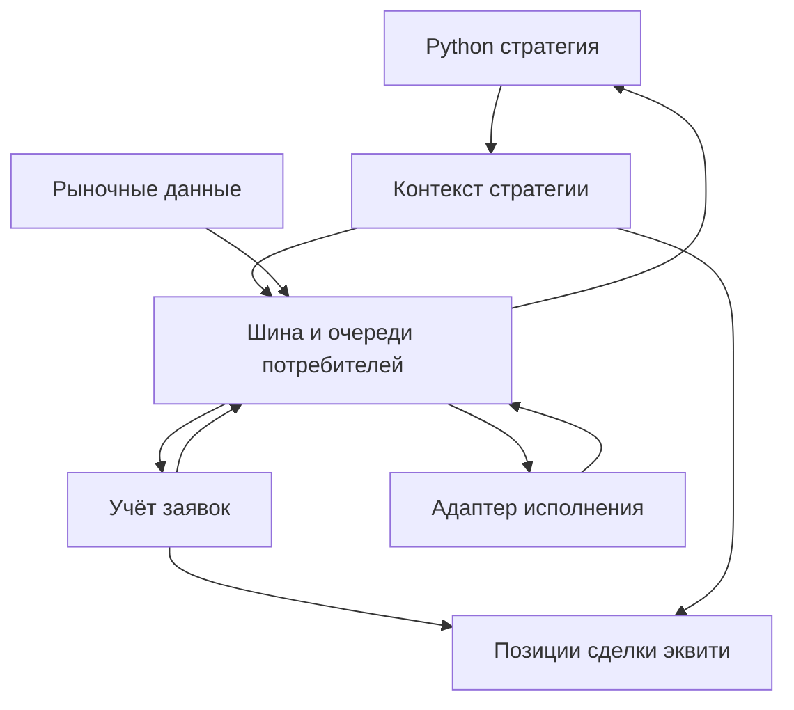
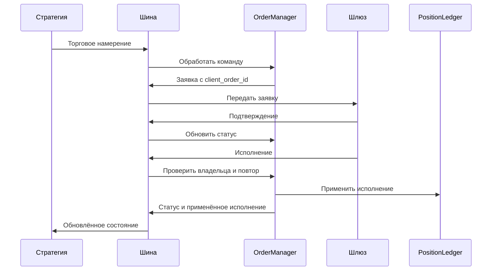
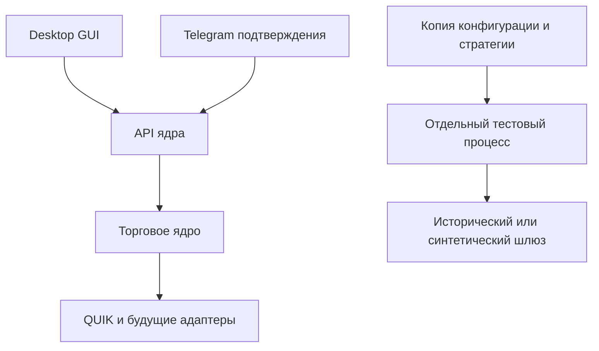

# Архитектурный эскиз TradingSystem v2

Согласовано 6 октября 2026 года. Это исходные границы для разработки через XP и TDD. Детали уточняются тестами и рефакторингом по мере реализации итераций.

## Границы первой итерации

Первая итерация реализует один сквозной сценарий без подключения к брокеру: Python-стратегия получает завершённую свечу, создаёт торговое намерение, симулятор подтверждает заявку и передаёт управляемое исполнение. Учёт обновляет виртуальную позицию. После полного завершения торгового цикла появляется новая точка закрытой эквити.

В первой итерации исполнение симулятора задаётся тестом или демонстрацией вручную. Это проверка цепочки учёта, а не историческая модель исполнения. Исторический шлюз с правилами следующего бара появится на этапе 4. Изоляция тяжёлых вычислений, конечные очереди, сохранение, отмена, стопы и восстановление ещё не реализуются; первая итерация не предназначена для live.

## Компоненты и владельцы состояния

Стратегия получает данные и создаёт намерения через контекст. Контекст связывает её идентичность с командами, предоставляет модельное время и неизменяемые представления её собственного состояния. Стратегия не получает объект шлюза или глобальную шину.

OrderManager назначает клиентские идентификаторы, проверяет намерения, владеет заявками и связывает исполнения с владельцем. PositionLedger владеет виртуальными позициями, закрытыми сделками и эквити. Эти данные не пересчитываются независимо в стратегии.

EventBus доставляет типизированные сообщения по именованным очередям. Один потребитель обрабатывает свою очередь последовательно. Публикация помещает сообщение в очередь и не ждёт callback. Ошибки обработчиков доступны вызывающему коду при ожидании завершения обработки; они не прекращают обслуживание остальных очередей. В первой итерации очереди не ограничены; приоритеты и перегрузка появятся отдельно. Длительный синхронный Python-код пока способен задержать event loop, поэтому изоляция ML-расчётов остаётся будущей задачей.

Адаптер получает команду отправки через собственную очередь, подтверждения и исполнения возвращает событиями. Clock инъецируется; расчёт состояния не использует системное время напрямую.

## Исполнение и обновление состояния

Размещение намерения и подтверждение заявки не меняют позицию. Только валидное исполнение меняет количество, среднюю стоимость и реализованный результат. Повтор того же execution_id не применяется снова; повтор с другим содержимым считается ошибкой. Идентификатор исполнения рассматривается в пространстве его gateway_id.

Первый учёт использует average-cost и абсолютный P&L в одной отчётной валюте RUB. Множитель контракта применяется к ценовой разнице. Суммирование результатов разных валют без FX-преобразования отклоняется. FX-сервис появится до многовалютного распределения капитала.

При частичном закрытии реализованный P&L накапливается в текущей сделке, но closed-equity ещё не меняется. Цикл завершается, когда все позиции стратегии становятся нулевыми. Переворот закрывает прежний цикл и начинает следующий, если после закрываемой части все ноги flat; при другой открытой ноге общий цикл продолжается. Комиссия исполнения распределяется между закрытой и открытой частью пропорционально количеству. История сохраняется отдельно от вычислительного состояния стратегии на этапе persistence.

## Процессы целевой системы

GUI и ядро независимы. Бэктест получает копию конфигурации и код стратегии, собственное хранилище и окружение, без объектов live-шлюзов. API подтверждения общий для GUI и удалённого клиента. Самостоятельный IPC и удалённый клиент не входят в первую итерацию.

## Зафиксированные правила для следующих итераций

- Desired leverage — положительный модификатор веса: `effective_weight[i] = weight[i] * desired[i] / sum(weight * desired)`. Вес служебной ручной стратегии равен нулю. Её уже открытые позиции учитываются в ограничениях счета.
- Максимальное плечо задаётся на счёт. Ёмкость счёта определяется его средствами и максимальным плечом. Пропорции ног ограничивают доступный масштаб корзины. При распределении сначала рассматриваются стратегии с большим числом счетов, затем с большим эффективным весом; детерминированный tie-break задаётся идентификатором.
- Освободившиеся остатки перераспределяются повторными проходами. Занятый позициями и активными заявками ресурс не изымается при плановом перерасчёте. Резерв не является весом стратегии.
- При внешнем дефиците после оповещения и пользовательского таймера сокращаются связанные с дефицитным счётом позиции, начиная с наибольшего абсолютного количества лотов. Для корзины применяется единый коэффициент сокращения, сохраняющий пропорции ног в общей валюте; сокращение прекращается после устранения дефицита с учётом дискретности лотов. Сравнение лотов — выбранная пользователем политика, а не оценка экономического размера позиции.
- Общая защита корзины использует совокупный P&L. Стандартная защита ставится на фактически исполненное количество, включая незавершённую часть входа. Сложная логика может принадлежать стратегии.
- Замена заявки сначала подтверждает отмену старой и учитывает её исполнения, затем отправляет новую на актуальный остаток. Перекрытие заявок отложено.
- В бэктесте совпадающие события идут в порядке исполнения/обновления ордера, свечи, таймера. Новая заявка не исполняется по уже полученному бару. Лимит исполняется по своей действующей цене при допустимых условиях. Модель частых перестановок и Монте-Карло исследуются отдельно; исполнения стопов на баре активации исключаются.
- Синтетические live-свечи используют last; при его отсутствии допустим mid. История заполняется предыдущим close, отсутствие начальной цены является ошибкой. Новая свеча и коррекция имеют разные обработчики.
- Обновление стратегии выполняется после закрытия позиций либо после явно подтверждённой передачи позиций и связанных ордеров служебной ручной стратегии. Эквити не удаляется со сброшенными индикаторами.
- Первые production-настройки предусматривают QUIK для фьючерсов, таймаут подтверждения/отмены 90 секунд, stale candles по таймфрейму с учётом календаря. GUI сохраняет конфигурацию представлений; восстановление открытых окон необязательно.

Точные сигнатуры будущих менеджеров и transport выбираются по работающим сценариям. Пустые реализации всех запланированных классов заранее не создаются.
