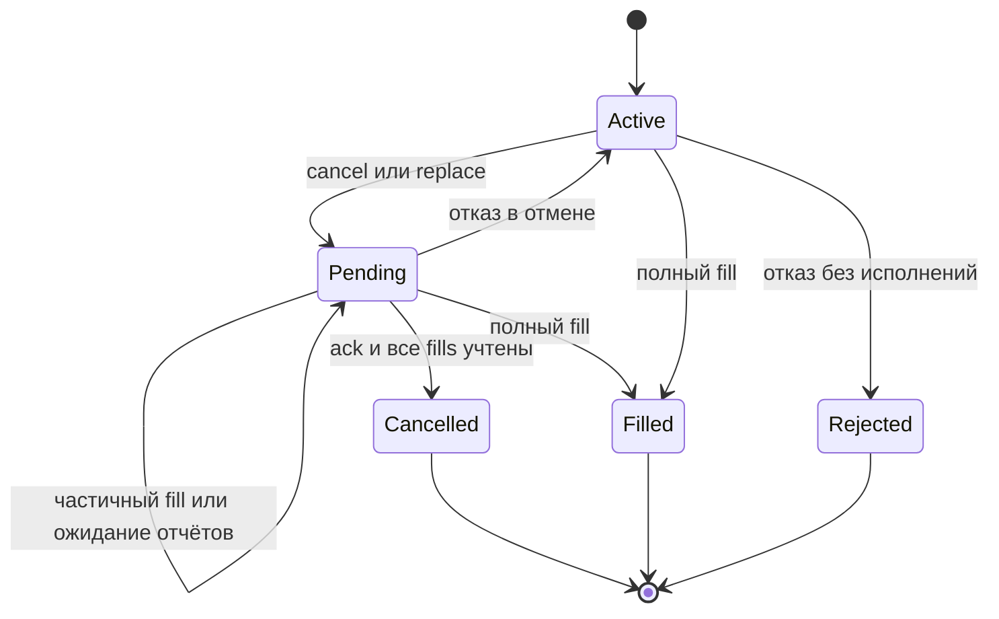

# Итерация 2: отмена, замена и гонки исполнения

Дата: 7 октября 2026 года. Продолжение [первой итерации](iteration-01.md), этап 2 [плана](development-plan.md).

## Поведение для автора стратегии

`OrderIntent(..., limit_price=None)` создаёт рыночное намерение; конечная `limit_price` — лимитное. Симулятор и OrderManager отклоняют цену исполнения хуже лимита: для покупки выше, для продажи ниже. Управляемая симуляция допускает цену лимита и улучшение цены, как реальные отчёты исполнения. Историческая модель исполнения по действующему лимиту относится к этапу 4.

`context.cancel_order(order_id)` запрашивает отмену. Статус становится `CANCEL_PENDING`; до окончательного подтверждения возможны исполнения. `context.replace_order(order_id, intent)` сначала отменяет старую заявку, затем создаёт новую. Маршрут и сторона сохраняются. Новая цена задаётся в `intent`.

Количество замены — целевой суммарный объём **конкретной заменяемой заявки**, включая её уже состоявшиеся исполнения. Пример: исходная заявка на 5, исполнено 2 до замены и ещё 1 во время отмены → новая заявка на 2. При повторной замене применяется объём текущей заявки в цепочке, а не первоначальной. Если новый целевой объём уже исполнен, неисполненный остаток отменяется, новая заявка не создаётся; выполненные сделки не обращаются автоматически.

В истории сохраняются обе заявки и связи `replaces_order_id` / `replacement_order_id`. `remaining_quantity` показывает неисполненную часть цели заявки; для завершённой отменой заявки это не активный объём на бирже. Комиссии и исполнения учитываются по своим заявкам; позиции и эквити остаются общими для стратегии.

## Контракт шлюза и порядок событий

Каждая попытка отмены имеет отдельный `request_id`. Ответ относится к конкретной попытке и шлюзу. `GatewayCancelled` содержит окончательное суммарное исполненное количество на момент подтверждённой отмены. После этой границы шлюз не допускает новых исполнений, но уже состоявшиеся отчёты могут доставляться с задержкой.

OrderManager ждёт, пока все исполнения до указанного количества применены к PositionLedger. До этого статус остаётся `CANCEL_PENDING` и замена не отправляется. Это работает для обоих порядков сообщений: исполнения перед подтверждением и подтверждение перед отчётами об исполнениях. При полном исполнении исходной заявки итоговый статус остаётся `FILLED`.

`Active` объединяет `SUBMITTED`, `ACCEPTED` и `PARTIALLY_FILLED`. При полном fill во время отмены техническое ожидание исхода попытки ещё может продолжаться; дополнительный объём увеличенной цели отправляется только после успешного подтверждения этой попытки.

Будущий live-адаптер обязан обеспечить этот окончательный итог отмены: при недостаточной информации от брокера сначала сверить исполнение и состояние заявки. Простого сообщения «отменено» без сверенного количества недостаточно. Нарушение контракта вызывает наблюдаемую ошибку; автоматического исправления финансового состояния в этой итерации нет.

## Отказы и повторы

Отказ отмены возвращает актуальное активное состояние старой заявки, сохраняет исполнения и причину отказа; план замены снимается. Отказ новой заявки сохраняет старую завершённой и не возобновляет её автоматически. Повтор подтверждения с тем же содержимым не меняет состояние; конфликтующий повтор отклоняется. Запоздалое подтверждение отправки не откатывает терминальное состояние.

Повтор одинаковой замены во время ожидания идемпотентен. Другая замена в этот момент отклоняется. Явная отмена снимает ранее запрошенный план замены. Команды проверяют владельца: стратегия не управляет заявками другой стратегии. После ошибки стратегии новые заявки и замены запрещены, но отмена доступна, пока среда активна.

## TDD и проверки

Первый набор тестов отмены и замены был запущен до появления контрактов и упал на отсутствующем `GatewayCancelled`. После минимальной реализации прошли 14 сценариев. Дополнительные проверки воспроизвели и помогли исправить запрет отмены после ошибки стратегии и погрешность относительного допуска, скрывавшего целый лот при большом количестве. Допуск теперь связан с шагом инструмента, а не масштабом позиции.

64 теста проходят локально, включая 30 сценариев первой итерации. Строгая проверка mypy охватывает ядро и обе демонстрации (11 файлов). CI повторяет установку, тесты, типы и примеры на Linux и Windows. [Инструкция запуска](README.md) содержит команды и ожидаемые результаты.

## Границы и следующий шаг

Пока это офлайн-среда с управляемыми исполнениями и подтверждениями. Очереди, попытки отмены и дедупликация находятся в памяти. Таймеры ожидания, сохранение, восстановление и broker reconciliation ещё не реализованы. Если подтверждение или недостающий отчёт не приходит, замена остаётся заблокированной; это не приравнивается к успешной отмене.

Следующий этап — критический журнал, SQLite-хранилище и восстановление состояния при прерывании обработки событий.
